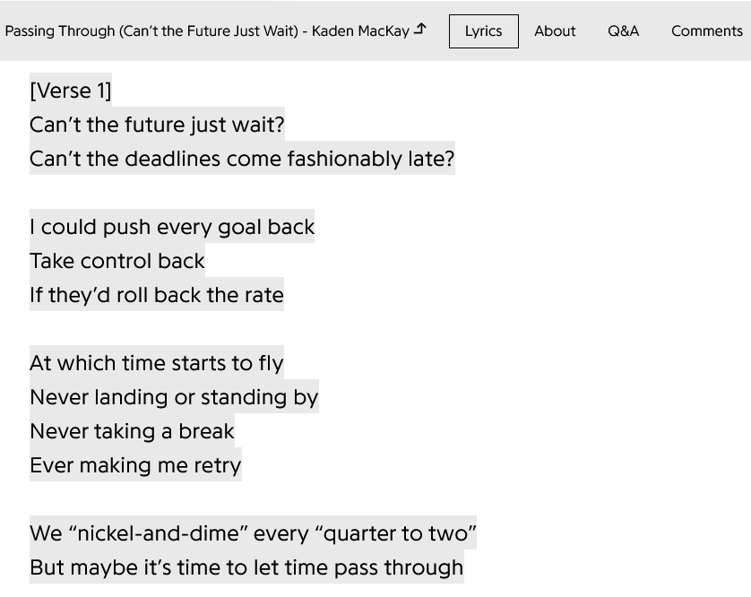
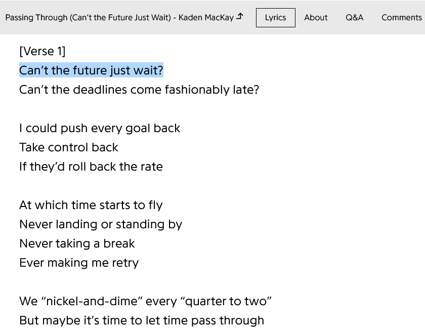

# Genius Lyrics Cleaner

**Instantly removes all annotations, pop-ups, highlights, and the "Sign Up to Start Annotating" tooltip from Genius.com — leaving you with perfectly clean, readable, copy-pasteable lyrics.**

No more yellow boxes. No more accidental pop-ups. Just lyrics.

### Before → After

  
  →
  

### Features
- Survives scrolling and lazy-loading
- Removes the "Sign Up to Start Annotating" tooltip when selecting text
- No data collection · No external requests · Only runs on genius.com

### Installation
Get it on Firefox Add-ons:  
https://addons.mozilla.org/firefox/addon/genius-lyrics-cleaner/

(Chrome/Edge version coming soon if there’s demand)

### How to Use
1. Click the extension icon in your toolbar
2. Toggle **Clean Lyrics** on or off
3. Enjoy distraction-free lyrics instantly

When turned off → page reloads to restore original Genius look.

### License
This project is licensed under the **Mozilla Public License 2.0** — see [LICENSE](LICENSE) for details.

Contributions welcome! Pull requests and issues are encouraged.

Made because Genius forgot that some people just want to read the damn lyrics.